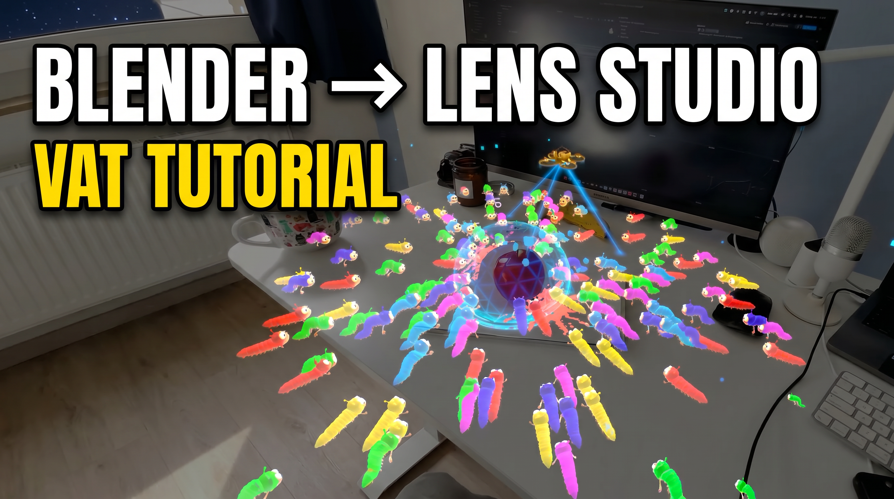
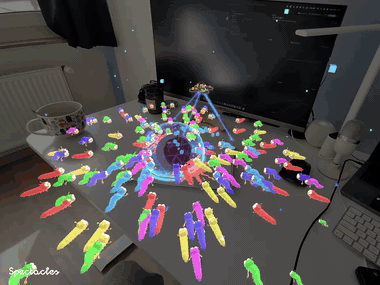
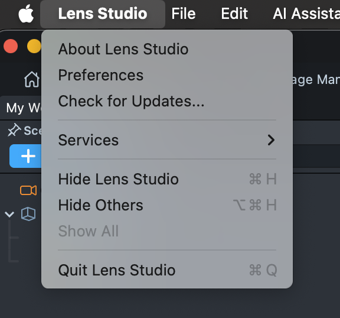
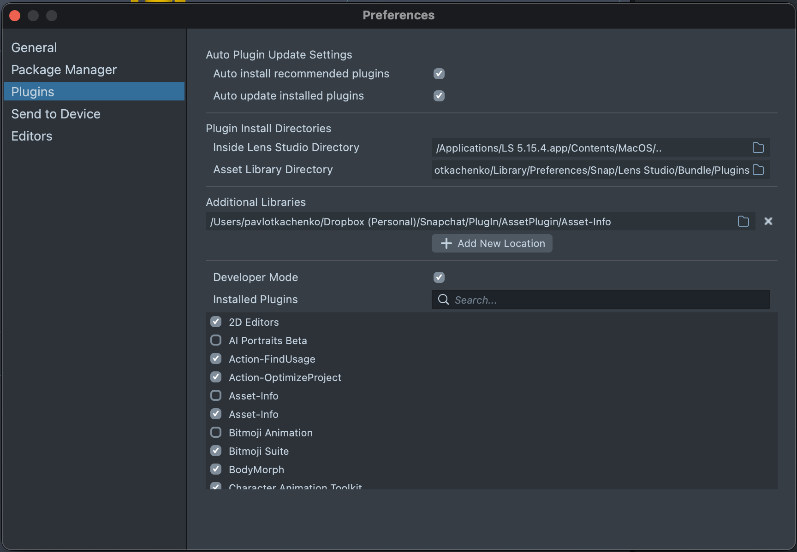
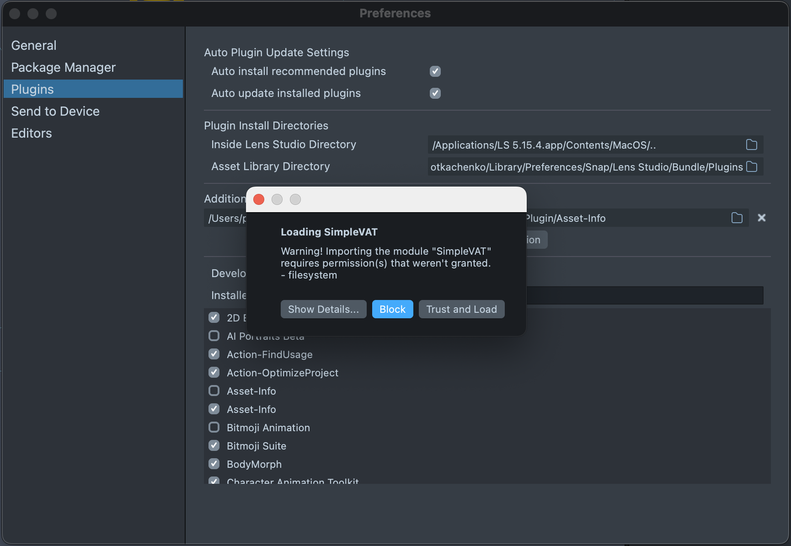
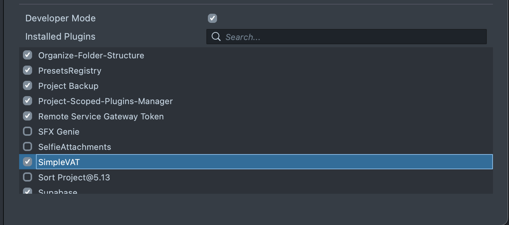
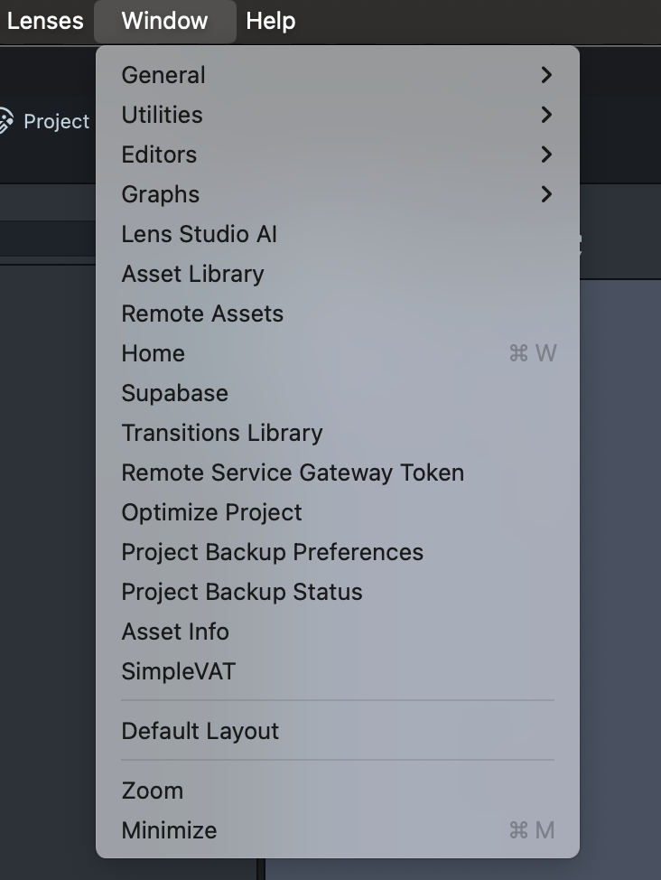
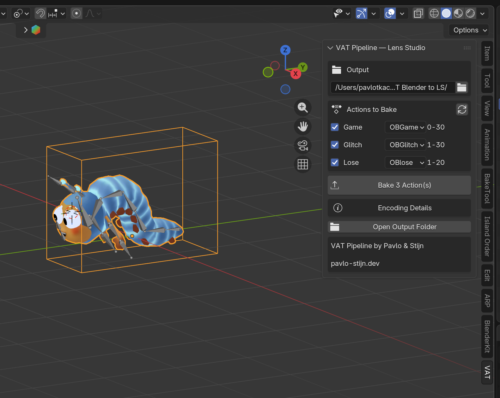
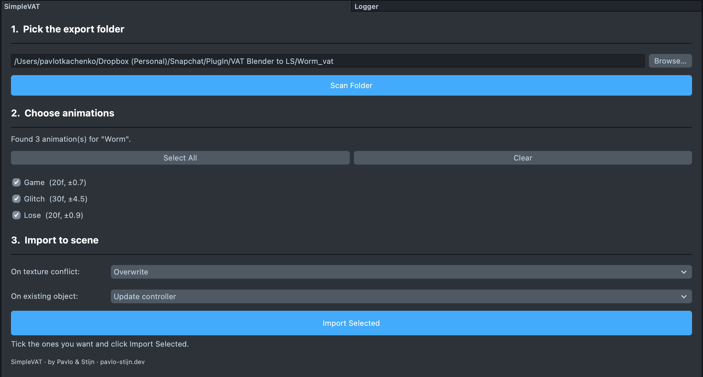

# LensStudio-SimpleVAT

**Bake vertex-animation textures in Blender, drop them into Lens Studio with one click.**

<p align="center">
  <a href="https://youtu.be/V6wNZuK7GWk">
    
  </a>
</p>

<p align="center">📺 <a href="https://youtu.be/V6wNZuK7GWk"><b>Watch the walkthrough on YouTube →</b></a></p>

<p align="center">
  
</p>

<p align="center"><em>From <a href="https://www.linkedin.com/posts/stijn-spanhove_this-is-our-submission-for-the-spectacles-activity-7401212775974465536-FYWD"><b>Fruit Defence</b></a>. Dozens of animated meshes at once — a bone rig per character wouldn't fit the perf budget.</em></p>

Two-part open-source pipeline for Snap Spectacles:
- **Blender add-on** that bakes skeletal / shape-key / cloth / soft-body animation into a VAT export folder.
- **Lens Studio plugin** (`SimpleVAT`) that imports that folder and wires up mesh, material, controller in the scene.

> Install just `SimpleVAT/` if you only need the LS side and the VAT folder comes from somewhere else.

---

## Why

A scene with many animated characters and full bone rigs hits the Spectacles perf budget fast. SimpleVAT bakes the animation into a texture; at runtime the GPU samples it per vertex.

- **No bones** in the scene — one mesh + one shader + one tiny controller.
- **No CPU anim eval** — pure vertex shader.
- **Cheap instancing** — many copies share the texture; one material per visual variant.
- **One draw call per group** instead of one per skinned hierarchy.

Trade-off: the animation is **baked and immutable** — no IK, no runtime bone blending, no procedural retargeting. Switching between multiple baked clips is supported via the controller API (`controller.play("Run")`).

## What you can build with this

- **Crowds and swarms** — fish, birds, insects, worms. Give each instance a different `setTimeOffset()` so they don't tick in lockstep.
- **Ambient world life** — flags, plants, breathing volumes, idle background creatures.
- **Cloth / soft-body playback** — bake a cached Blender sim once, replay it deterministically with zero physics cost. Topology must stay constant, so liquid meshes / particles / smoke / fracture sims don't fit.
- **Character cameos** — small NPCs with a handful of looped clips (idle / wave / dance) switched via `play("Wave")`.
- **Procedural reveals** — unfold / morph / build-up authored in Blender, triggered on a beat or interaction.
- **Vertex FX on a single mesh** — portals, energy waves, pulsing crystals, vines unfurling. Not for particle explosions or liquid splashes.

> 2K × 2K is the per-clip ceiling on Spectacles. Conservative on purpose — the pipeline can be extended later, but the current limits cover most real cases without complicating the format.

---

## How it works

1. **Blender** — pick actions (or use the scene timeline / NLA / sim / shape keys). One click bakes each animation into `{base}_{anim}_vat.png` + a JSON sidecar. A shared `{base}.fbx` carries the rest pose.
2. **Lens Studio** — the SimpleVAT panel scans the folder, lists detected animations, imports the ones you tick, creates the material, spawns the mesh, attaches the controller.
3. **Runtime** — `controller.play("Run")` switches clips. The vertex shader samples the texture; cost per instance is negligible.

---

## Repository layout

```
LensStudio-SimpleVAT/
├── BlenderAddon/            ← Blender 4.2+ add-on
├── SimpleVAT/               ← Lens Studio 5 plugin
│   ├── main.js
│   └── Resources/
│       ├── VAT.ss_graph                  (shader)
│       └── VATAnimationController.ts     (runtime API)
├── README.md
└── LICENSE
```

---

## Install

### Blender add-on
1. Download `BlenderAddon.zip` from the repo root.
2. Blender → **Edit › Preferences › Get Extensions › Install from Disk…** → pick the zip.
3. Panel: `View 3D › Sidebar (N) › VAT`.

### Lens Studio plugin

1. Open **Lens Studio → Preferences**.

<p align="center">
  
</p>

2. In Preferences go to the **Plugins** tab. Under **Additional Libraries**, click the **+ Add New Location** button and pick the folder where you cloned this repo (the one containing `SimpleVAT/`).

<p align="center">
  
</p>

3. Lens Studio asks for permission to load the module. Click **Trust and Load**.

<p align="center">
  
</p>

4. **SimpleVAT** now shows up in the **Installed Plugins** list — make sure its checkbox is ticked.

<p align="center">
  
</p>

5. Open the panel via **Window → SimpleVAT**.

<p align="center">
  
</p>

---

## Workflow

### Bake in Blender

<p align="center">
  
</p>

1. Select the mesh, open the **VAT** sidebar, set Output folder.
2. **Refresh Actions** → tick what to bake. For 4.4+ slotted actions, pick the right slot in the row's dropdown.
3. **Bake N Actions**.

Output per anim: `{base}_{action}_vat.png` + `{base}_{action}.json`. Shared: `{base}.fbx`.

### Import in Lens Studio

<p align="center">
  
</p>

1. **Browse** to the `{base}_vat/` export folder. The plugin scans automatically.
2. Tick animations to import. Set policies:
   - **On texture conflict:** Overwrite / Skip existing
   - **On existing object:** Update controller / Replace object / Skip scene
3. **Import Selected**.

Creates `Assets/VAT/{base}/` with the material, shader, controller script, textures, and FBX. Spawns `{base}_VAT` SceneObject with everything wired.

### ⚠️ Mandatory post-import — disable texture compression

The textures land in a folder named `Textures (Remove Compression)` as a reminder. **You MUST disable compression on every VAT texture** or it renders broken (banding, scrambled deformation).

For each texture: Inspector → **Optimization Type → `None`**. Recommended also: **Filtering → `Nearest`**, **Mip Maps → Off**. The VAT format encodes precise per-pixel offsets — averaging neighbors corrupts the encoding.

---

## Runtime API — VATAnimationController

```typescript
class VATAnimationController extends BaseScriptComponent {
    // Inputs populated by the importer:
    material: Material;
    animationNames: string[];
    positionMaps: Texture[];
    numFramesArr: number[];
    bboxMaxArr: number[];
    speedArr: number[];
    defaultIndex: number;
    autoPlayOnStart: boolean;

    // API:
    play(name: string): boolean;
    playIndex(index: number): boolean;
    setTimeOffset(seconds: number): void;
    setSpeed(speed: number): void;
    getAnimations(): string[];
    current(): string;
    currentIndex(): number;
}
```

### Drive it from your own script

```typescript
@component
export class WormBehavior extends BaseScriptComponent {
    @input vat: VATAnimationController;

    onAwake() {
        this.createEvent("TapEvent").bind(() => this.vat.play("Attack"));
    }
}
```

Drag the spawned `{base}_VAT` object into the `vat` input — LS resolves the component automatically.

---

## Limits

**Texture size: 2048 × 2048 max** (Spectacles cap).

| Axis | Encodes | Max |
|---|---|---|
| Width | one column per vertex | 2048 verts |
| Height | one row per frame | 2048 frames |

The Blender add-on **refuses to bake** if either limit is exceeded. To stay under:
- **Too many vertices** → decimate (`Modifier › Decimate`) or split the mesh and bake parts separately.
- **Too many frames** → trim the action, lower fps (24 ≫ 60), or split into multiple clips. At 60 fps that's ~34 s per clip; at 24 fps ~85 s.

**Other:**
- Topology must stay constant across baked frames.
- One material per imported mesh — duplicate the material asset if you instantiate the prefab in multiple places.
- No normal-map output; the shader uses face-derived normals from the rest mesh.
- LS asset-delete API is unreliable. On `Overwrite` re-import, old texture assets sometimes linger as `Texture 2`. Delete manually, or use `Skip existing`.

---

## Coordinate system

Blender is Z-up, Lens Studio is Y-up. The shader bakes the swap in when sampling — no manual conversion in either half.

---

## Tested with

Blender 4.2 → 5.1 · Lens Studio 5.10+ · Snap Spectacles (2024)

---

## Contributing

PRs welcome. Each side is a few hundred lines — easy to read and modify. Keep new dependencies minimal; both plugins should stay drop-in installable.

## License

[MIT](LICENSE) — do what you want, attribution appreciated.

## Authors

**Pavlo Tkachenko & Stijn Spanhove** · [pavlo-stijn.dev](https://pavlo-stijn.dev) · 2026
