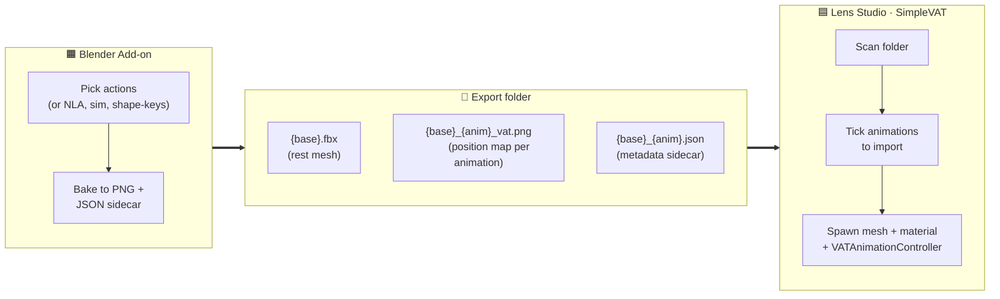

# LensStudio-SimpleVAT

**Bake vertex-animation textures in Blender, drop them into Lens Studio with one click.**


_Above: dozens of animated meshes running simultaneously on Spectacles — the same scene with a traditional bone rig per character wouldn't hit the perf budget._

A two-part open-source pipeline for Snap Spectacles:
- A **Blender add-on** that bakes any skeletal / shape-key / simulation animation into a Vertex Animation Texture (VAT) export folder.
- A **Lens Studio plugin** (`SimpleVAT`) that scans that folder, imports the meshes / textures / shader / runtime controller, and wires everything up in the scene.

> _If you only need the LS plugin — install just `SimpleVAT/` and feed it a VAT folder you exported elsewhere._
> _If you want the full pipeline — install the Blender add-on too._

---

## Why this exists

Spectacles is performance-tight. A scene with **dozens of animated characters**, each carrying an armature with full bone evaluation, hits the draw-call / CPU budget fast — runtime bone transforms are expensive, every skinned mesh adds work, and the scene graph balloons.

SimpleVAT removes that cost entirely. The animation is **baked into a texture once**; at runtime the GPU samples that texture per vertex. Result:
- **No bones in the scene** — just one mesh + one shader + one tiny controller component.
- **No CPU-side animation eval** — pure vertex shader.
- **Cheap instancing** — many copies of the same mesh share the same texture; one extra material per visual variant.
- **One draw call per visible group** instead of one per skinned hierarchy.

Practical effect: you can render **many more animated meshes simultaneously** than a bone-driven setup would allow on Spectacles hardware.

Trade-off: the animation is **baked and immutable** — you can't blend bones / drive IK / procedurally re-target at runtime. SimpleVAT is for content that can be authored ahead of time. Switching between **multiple baked clips** at runtime is supported via the `VATAnimationController` API (`play("Run")`, etc.).

## What you can build with this

Creativity is the limit. A few directions that fit naturally:

- **Crowds and swarms** — schools of fish, flocks of birds, insects, worms, particles with personality. One mesh, one shader, many copies, each with a `setTimeOffset()` so they don't move in lockstep.
- **Ambient world life** — flapping flags, swaying plants, idle creatures in the background of an AR scene, breathing volume of a sleeping monster.
- **Simulation playback** — bake a Blender cloth / soft body / fluid simulation once, replay it deterministically on Spectacles with zero physics cost.
- **Character cameos** — a small interactive NPC with a handful of looped clips (idle / wave / dance) switched on user gesture via `play("Wave")`.
- **Procedural object reveals** — bake an unfold / morph / build-up animation in Blender, trigger it on a beat or interaction.
- **Stylized VFX** — explosions, splashes, magic effects that need precise vertex-level animation but no per-instance variation.

Anywhere you'd reach for a bone rig **just to play back a pre-authored loop**, VAT will be cheaper and let you push the count up by an order of magnitude.

> The 2K texture limits below are deliberately conservative — Spectacles is performance-tight and the current ceilings (≤ 2048 verts and ≤ 2048 frames per clip) fit the vast majority of real use cases. The pipeline can be extended (vertex-row wrapping, multi-texture chains) to lift those limits, but for now the **balance of simplicity vs flexibility is the point**.

---

## How it works



At runtime, the bundled `VATAnimationController` script lets any other component switch animations with one call: `controller.play("Run")`. No bones evaluated on device — the whole animation is GPU‑sampled from the position texture.

---

## Repository layout

```
LensStudio-SimpleVAT/
├── BlenderAddon/            ← Blender 4.2+ add-on (Direct Bake, no GeoNodes)
├── SimpleVAT/               ← Lens Studio 5 plugin
│   ├── module.json
│   ├── main.js
│   └── Resources/
│       ├── VAT.ss_graph                  (bundled shader)
│       └── VATAnimationController.ts     (runtime API)
├── README.md
└── LICENSE
```

---

## Install

### Blender add-on

1. Download **`BlenderAddon.zip`** from the repo root (or build fresh via `./build_addon.sh`).
2. Blender → **Edit › Preferences › Get Extensions › Install from Disk…** → pick the zip.
3. The panel appears in `View 3D › Sidebar (N) › VAT`.

> _Contributors: after editing files under `BlenderAddon/`, run `./build_addon.sh` to refresh the zip before committing._

### Lens Studio plugin

1. Copy the `SimpleVAT/` folder into your project's `Plugins/` directory (or LS user-plugins folder for global use).
2. Restart Lens Studio.
3. Open `Window › Panels › SimpleVAT`.

---

## Workflow

### 1) Bake in Blender

1. Select the mesh (with armature, shape keys, or simulation modifiers).
2. Open the **VAT** sidebar.
3. Set the **Output** folder.
4. Click **Refresh Actions** → tick the animations you want.
5. (Optional) if an action has multiple slots, pick the right one in the dropdown.
6. Click **Bake N Actions**.

Output per animation: `{base}_{action}_vat.png` (position texture) + `{base}_{action}.json` (metadata sidecar).
Plus a shared `{base}.fbx` (rest pose, with `VAT_UV` layer).

### 2) Import in Lens Studio

1. Open the **SimpleVAT** panel.
2. **Browse** to the `{base}_vat/` export folder. The plugin auto-scans.
3. Tick the animations to import.
4. Configure import policies:
   - **On texture conflict:** Overwrite / Skip existing
   - **On existing object:** Update controller / Replace object / Skip scene
5. Click **Import Selected**.

The plugin creates `Assets/VAT/{base}/` with:
- `Materials/Shaders/VAT` (bundled shader graph)
- `Materials/{base}_VAT_Material`
- `Script/VATAnimationController`
- `Textures (Remove Compression)/...` (one PNG per animation)
- the imported FBX

And spawns a `{base}_VAT` SceneObject with the material applied and the controller attached.

### ⚠️ Mandatory post-import step — disable texture compression

The textures land in a folder literally named `Textures (Remove Compression)` for a reason. **You MUST disable compression on every VAT texture or the animation will render broken** (banding, jittering verts, scrambled deformation).

For each PNG inside `Textures (Remove Compression)/`:

1. Select the texture in the Asset panel
2. Open the Inspector
3. Set **Optimization Type → `None`**
4. (Recommended) set **Filtering Mode → `Nearest`** and **Mip Maps → `Off`**

This is unavoidable because the VAT format encodes precise per-pixel offset values — any compression / mip filtering averages neighboring pixels and corrupts the encoding.

---

## Runtime API — VATAnimationController

The controller is attached to the spawned mesh and exposes a small, stable API for other scripts to drive playback.

```typescript
class VATAnimationController extends BaseScriptComponent {
    // Inputs populated at import time:
    material: Material;
    animationNames: string[];
    positionMaps: Texture[];
    numFramesArr: number[];
    bboxMaxArr: number[];
    speedArr: number[];
    defaultIndex: number;
    autoPlayOnStart: boolean;

    // API:
    play(name: string): boolean;
    playIndex(index: number): boolean;
    setTimeOffset(seconds: number): void;
    setSpeed(speed: number): void;
    getAnimations(): string[];
    current(): string;
    currentIndex(): number;
}
```

### Connect from your own script

```typescript
@component
export class WormBehavior extends BaseScriptComponent {
    @input vat: VATAnimationController;

    onAwake() {
        this.createEvent("TapEvent").bind(() => this.vat.play("Attack"));
    }

    onHurt() {
        this.vat.play("Hurt");
    }
}
```

In the Inspector, drag the spawned `{base}_VAT` object into the `vat` field — LS resolves the component automatically.

---

## Coordinate system

Blender is Z-up, Lens Studio is Y-up. The shader applies the swap as it samples the texture (`offset.xzy` with Y-negation), so the export and import are direct — no manual conversion needed.

---

## Limits

### Texture size — 2K × 2K hard cap

Spectacles caps texture dimensions at **2048 × 2048**. The VAT format uses:

| Axis | Encodes | Max |
|---|---|---|
| Width | One column per vertex | **2048 vertices** |
| Height | One row per frame | **2048 frames** |

If you exceed either, the Blender add-on **refuses to bake** with an explicit error. Why we don't just allow it: Lens Studio would silently downscale the texture on import, and downscaling a VAT corrupts the per-pixel encoding → garbage animation at runtime.

How to stay under the limit:
- **Too many vertices** → decimate the mesh in Blender (`Modifier › Decimate`) or split the mesh into multiple objects and bake each separately.
- **Too many frames** → trim the action, reduce framerate (bake at 24 fps instead of 60), or split a long animation into multiple shorter clips.

For a 60 fps animation, the per-clip ceiling is about **34 seconds** (60 × 34 ≈ 2040 frames). For 24 fps it's ~85 seconds.

### Other limitations

- **Topology must stay constant** across all baked frames. The bake aborts if vertex count changes mid-animation.
- **One material per imported mesh.** The controller writes into that material at runtime to switch animations. If you instantiate the same mesh prefab manually elsewhere in the scene, duplicate the material asset so each copy has its own playhead.
- **No normal-map output.** The shader uses face-derived normals from the rest mesh — fine for organic deformation, less ideal for cloth / cape flaps.
- **Lens Studio asset deletion API is finicky.** On re-import with **Overwrite**, sometimes old texture assets remain alongside the new ones with a numeric suffix (`Texture 2`). Delete manually if it bothers you, or use **Skip existing** policy.

---

## Tested with

- Blender 4.2 → 5.1
- Lens Studio 5.10+
- Snap Spectacles (2024)

---

## Contributing

PRs welcome. The codebase is intentionally small (a few hundred lines per side) so it's easy to read and modify. Please keep new dependencies minimal — both plugins should be drop-in installable.

---

## License

[MIT](LICENSE) — do what you want, attribution appreciated.

## Author

**Pavlo Tkachenko** · 2026
